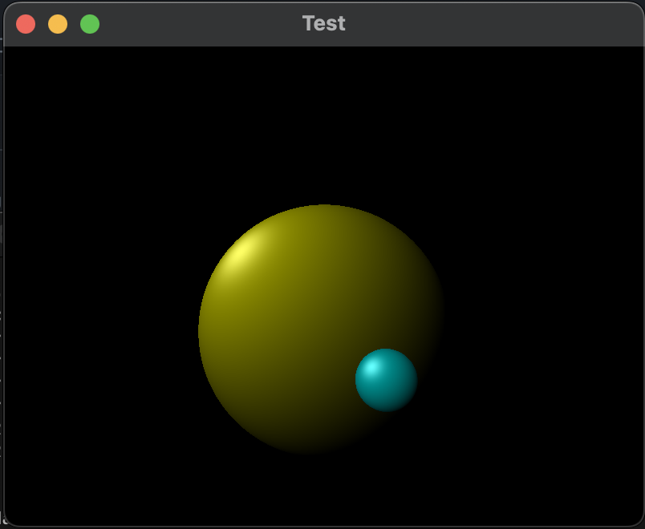

# Ray Casting

## Introduction

This is simple ray caster that uses SFML library for visualization.



## Build

Before cloning, make sure SFML is installed.

```
git clone https://github.com/kefirRzevo/RayCasting.git
cd RayCasting
mkdir obj
make
./app
```

